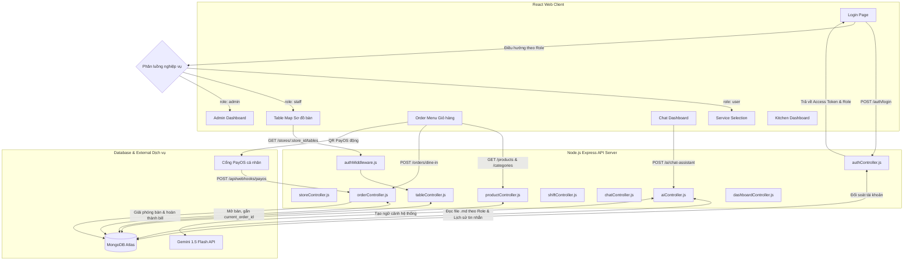

# TÀI LIỆU CƠ CHẾ PHÂN LUỒNG & DÒNG CHẢY DỮ LIỆU (FLOW & ROUTING SYSTEM)
**Dự án: Hệ thống quản lý bán hàng POS Cake & Drink**

Tài liệu này đặc tả chi tiết cơ chế phân quyền, định tuyến luồng nghiệp vụ và cách thức dữ liệu di chuyển giữa Frontend (React Vite) và Backend (Node.js/Express/MongoDB Atlas).

---

## 1. SƠ ĐỒ ĐỊNH TUYẾN TỔNG THỂ (SYSTEM ARCHITECTURE MAP)



---

## 2. CHI TIẾT CÁC LUỒNG VẬN HÀNH CHÍNH (KEY FLOW WORKFLOWS)

### 2.1. Luồng Xác thực & Phân quyền (Authentication & Role Authorization Flow)
1. **Frontend gửi yêu cầu**: Nhân viên/Khách hàng điền thông tin và gửi yêu cầu đăng nhập.
2. **Backend xử lý**: 
   * Tìm kiếm Email khớp trong MongoDB Atlas.
   * So sánh mật khẩu thô gửi lên với mã băm trong Database bằng thư viện `bcrypt`.
   * Cấp cặp đôi JWT: **Access Token** (hạn 15 phút, lưu trong RAM) và **Refresh Token** (hạn 7 ngày, lưu vào cookie/localStorage).
3. **Frontend lưu trữ**: Lưu thông tin `accessToken`, `userRole`, `username` và `storeId` vào `localStorage`.
4. **Phân luồng giao diện**:
   * **Admin (Quản trị)** $\rightarrow$ Chuyển hướng tới `/admin` để xem doanh số, món bán chạy, cảnh báo kho.
   * **Staff (Thu ngân)** $\rightarrow$ Chuyển hướng tới `/tables` hiển thị sơ đồ lưới các bàn thuộc chi nhánh đó.
   * **User (Khách mua online)** $\rightarrow$ Chuyển hướng tới `/` (Trang lựa chọn Giao hàng/Mang đi).
5. **Đảm bảo an ninh (Middleware Barrier)**:
   * Mọi request gọi lên API (trừ Đăng nhập/Đăng ký) đều đi qua `authMiddleware.protect` kiểm tra chữ ký Token.
   * Các API đặc quyền (như Xóa món, Sửa menu, Xem doanh số) bắt buộc đi qua `authorize('admin')` để ngăn chặn nhân viên hoặc người dùng bình thường tự ý thay đổi dữ liệu.

---

### 2.2. Luồng Nghiệp vụ Gọi món & Thanh toán tại Bàn (Dine-In Workflow)
Nghiệp vụ gọi món tại bàn là dòng chảy phức tạp nhất kết nối liên tục trạng thái Bàn ăn và Hóa đơn:

```
[Bàn Trống - Màu Xanh]
       │
       ▼ (Staff bấm mở bàn -> POST /orders/dine-in)
[Tạo đơn hàng nháp: payment_status = unpaid, status = serving] 
[Cập nhật trạng thái Bàn sang Occupied - Màu Đỏ, ghim current_order_id]
       │
       ▼ (Chọn món và thêm vào giỏ -> PUT /orders/:id/edit-items)
[Đồng bộ Giỏ hàng & Cập nhật tổng tiền] ── (Hủy/Giảm món: Yêu cầu Admin PIN -> Ghi log cancelled_items)
       │
       ▼ (In Bill Tạm Tính -> GET /orders/:id/print-draft -> In Phiếu K80 nháp)
[Quét mã QR PayOS thanh toán động]
       │
       ├─────────────────────────────────────────┐
       ▼ (Khách quét mã chuyển tiền thật)          ▼ (Nhân viên bấm xác nhận nhận tiền mặt)
[PayOS ghi nhận tiền tinh tinh]          [POST /orders/:id/settle]
       │                                         │
       ▼ (Webhook PayOS gọi public endpoint)     │
[POST /api/webhooks/payos]                 │
       │                                         │
       └────────────────────┬────────────────────┘
                            │
                            ▼
[Cập nhật hóa đơn sang: payment_status = paid, status = completed]
[Giải phóng Bàn ăn: status = available, current_order_id = null - Bàn chuyển Xanh]
```

* **Ghi vết chống thất thoát (Anti-Fraud Logs)**: Khi nhân viên thực hiện thao tác giảm số lượng hoặc hủy món, Frontend yêu cầu nhập mã PIN quản trị (`1234`). Khi khớp, API gửi kèm `admin_approver_id: "u_admin_01"`. Backend sẽ ghi nhận bản ghi này vào mảng `cancelled_items` của hóa đơn đó trong database để phục vụ công tác đối soát doanh thu cuối ngày.

---

### 2.3. Luồng Trợ lý ảo AI Gemini (RAG - Role-based AI Knowledge Routing Flow)
Hệ thống tích hợp Gemini API để trả lời thông minh dựa vào phân quyền tri thức:

1. **Khởi tạo phòng chat**: Hệ thống kiểm tra xem user hiện tại đã có phòng AI chưa qua API `/chats/rooms`.
2. **Gửi tin nhắn**: Khi gửi câu hỏi từ chatbox (API `/ai/chat-assistant`), Backend sẽ thực hiện:
   * **Bước 1**: Đọc lịch sử 5 tin nhắn gần nhất từ MongoDB để hiểu ngữ cảnh trò chuyện tiếp theo.
   * **Bước 2 (Phân luồng Tri thức)**:
     * Nếu **Khách hàng (`user`)** $\rightarrow$ Backend nạp tệp tri thức tĩnh `ai_knowledge_user.md` (giới thiệu thực đơn, chi nhánh, chính sách giao hàng).
     * Nếu **Nhân viên/Admin (`staff`/`admin`)** $\rightarrow$ Backend nạp tệp tri thức `ai_knowledge_staff.md` (công thức pha chế, quy định giao ca nội bộ, mã PIN, két tiền).
   * **Bước 3**: Đóng gói nội dung file tri thức làm `systemInstruction` và lịch sử chat gửi lên API Gemini `gemini-1.5-flash`.
   * **Bước 4**: Nhận kết quả phản hồi của AI $\rightarrow$ Lưu kết quả vào cơ sở dữ liệu `Message` $\rightarrow$ Trả về dữ liệu JSON để hiển thị trực quan lên giao diện Frontend.

---

### 2.4. Luồng Nghiệp vụ Kết ca & Đối soát Tài chính (Shift Reconciliation Flow)
1. **Mở két tiền (Open Shift)**: Đầu ca trực, nhân viên đếm số tiền lẻ thối trong ngăn kéo két sắt và khai báo số dư đầu ca qua API `/shifts/open`. Ca trực chuyển sang trạng thái `open`.
2. **Theo dõi dòng tiền tự động**:
   * Khi hoàn thành các hóa đơn trong ca trực, máy tính tự động cộng dồn tiền mặt (`system_cash_collected` đối với đơn dine-in/take-away) và tiền chuyển khoản ngân hàng (`system_banking_collected` đối với đơn delivery/quét QR).
   * Nhân viên có thể nhấn **Đồng bộ két tiền** ở Topbar bất cứ lúc nào để gọi API `/shifts/sync-cash` để lấy số dư két dự kiến hiện tại.
3. **Đóng ca trực (Close Shift)**: 
   * Cuối ca, nhân viên kiểm đếm toàn bộ tiền mặt thực tế đang có trong két sắt bàn quầy và nhập số tiền này vào ô `closing_cash_actual`.
   * Hệ thống sẽ tự động tính toán:
     $$\text{expected\_cash} = \text{opening\_cash} + \text{system\_cash\_collected}$$
     $$\text{difference (Lệch tiền)} = \text{closing\_cash\_actual} - \text{expected\_cash}$$
   * Lưu toàn bộ kết quả chênh lệch tiền kèm ghi chú, chuyển ca trực về trạng thái `closed` để ban quản lý vào đối soát camera nếu phát sinh lệch tiền.
